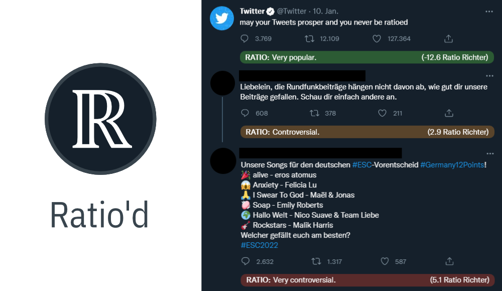

Ratio'd
===

Ratio'd is a chrome extension that highlights tweets with exceptionally bad [ratios](https://knowyourmeme.com/memes/the-ratio) on Twitter, by adding a small bar under any noteworthy tweet, to help with analyzing which tweets do well, and which do not.

## The Ratio

The ratio is originally described as the ratio of retweets or likes to the amount of replies a tweet has. If replies outweigh the likes, the tweet is generally considered to be a bad tweet.

### Calculation Methods

While the ratio is generally more of a meme / a rule-of-thumb, we actually want to quantify it to be able to decide rationally if a ratio is noteworthy or not. For this purpose, the extension offers two modes of calculation that can be used.

#### The Ratio Richter (default)

This is a [logarithmic scale designed by "Data for Progress"](https://www.dataforprogress.org/the-ratio-richter-scale) to measure the severity of a tweet and is the closest to a gold standard for measuring "the ratio" there is.
It is inspired by the Richter scale for measuring earthquake severity and is defined as follows:

`ln(replies / likes) * log(replies)`

#### Balanced Score

This, while not technically being a ratio, is a very simple scoring method which was used in the development process of this plugin.
It is defined as follows:

`((retweets - replies) + 2 * (likes - replies)) / 3`

Unlike the Ratio Richter, this takes into account the retweets a tweet has. It also behaves consistently for tweets on the positive side of the spectrum, should you choose to display the bar on these tweets as well. For this reason, it is still available as an optional alternative.

## Limitations

Currently, the following limitations apply:

- The extension can display the ratio bar only on feed-style tweets, not on, for example, status pages. This is due to a lack of information about the amount of replies on status pages.
- The extension currently only works correctly if the language is set to one of:
    - English
      - British
      - American
    - German
    - Swedish
    - Spanish
    - Portuguese
    - Italian
    - Ukrainian
    - French

## Installing

This extension can be installed in multiple ways.

### Chrome Web Store (preferred)

You can easily add Ratio'd to your browser from the Chrome Web Store!
https://chrome.google.com/webstore/detail/ratiod/kmcheccfkipimiamcgdbjoemdoobiaim

### Unpacked

See [here](https://developer.chrome.com/docs/extensions/mv3/getstarted/#unpacked), for how to load an unpacked extension.

## Settings

There are some settings you can use to tweak the extension's behavior by heading into the extension options.

### Calculation Mode

see "Calculation Methods".

### Display positive ratios

This extension is configured by default to only highlight exceptionally negative tweets to reduce clutter while browsing Twitter. Usually the ratio is only really interesting when a tweet did badly.

If you are interested in displaying the ratio bar for exceptionally positive tweets as well (as seen in the screenshot above), you can do so by enabling it in the extension options.

## Contributing

By contributing, you agree that your contributions will be licensed under the project's [MIT License](https://github.com/PRTTMPRPHT/ratiod/blob/master/LICENSE).

## Further legalese
TWITTER, TWEET, RETWEET and the  Twitter Bird logo are trademarks of  Twitter Inc. or its affiliates.
